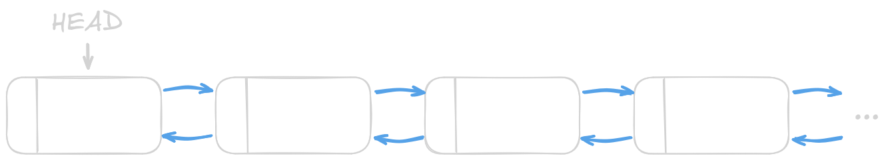
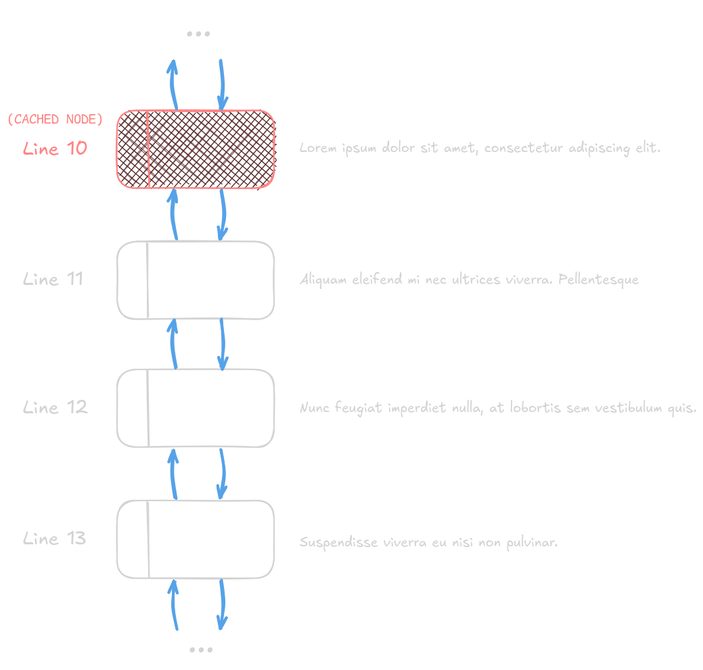

# elmo

**elmo** (/ˈɛl.moʊ/) is a text editor focused on viewing and editing simple configuration and source code files.

It is derived from [kilo](https://github.com/antirez/kilo), as I was following this excellent [tutorial](https://viewsourcecode.org/snaptoken/kilo) while building it. While most of the front-end features are similar to **kilo**, **elmo** has its own buffer back-end design.

## Buffer chain

So, while researching how to make a text editor, one of the questions (maybe the most important) was "*How do I represent a text file in buffer?*". For simple projects like this one, most people recommend just using a simple string as back-end, but the operation of insertion and deletion can become a problem if each character after an operation has to move to make room for a new character or occupy the space left by a deletion (see this [video](https://www.youtube.com/watch?v=g2hiVp6oPZc)).

I came across the tutorial I mentioned before and it uses an array of strings, with each element of the array representing a line. This works better if you only manipulate a single line, but what about adding a new one? Or merging multiple? Same problem as before, just at a different scale.

To address that specific problem and keep things simple (and because I just wanted to experiment and have fun), I use a linked list of lines. I named it **Buffer chain**.



It has a **HEAD** which always points to first node. Each node represents a line of the text. So, in order to display the text, the **HEAD** is fetched and its content printed. Then, by visiting the next node, its content can be printed too and so on.

Insertion and deletion operations that involve adding or deleting lines just need to manipulate nodes and its relations.

The problem now is "*What if the window only displays the text starting from line 10?*". Reading operation must begin from **HEAD** because that is the only *entrypoint* to the "chain". To solve this issue, I just cache the node associated with the line from which the text editor will begin to display the text at a certain moment. So, in every screen refresh, the starting line will be fetched directly.



A header file describing the operations to interact with a Buffer chain can be found [here](./include/bufchn.h).

## Build

### Requirements
- `gcc`
- `make`

```sh
make
```

It will generate the `elmo` binary.

## TODO

- [ ] Search
- [ ] Syntax highlight
- [ ] Auto indent
- [ ] Soft-wrap
- [ ] Tasks
- [ ] New empty buffer
- [ ] Open file (switch buffer)
- [ ] Undo/redo actions